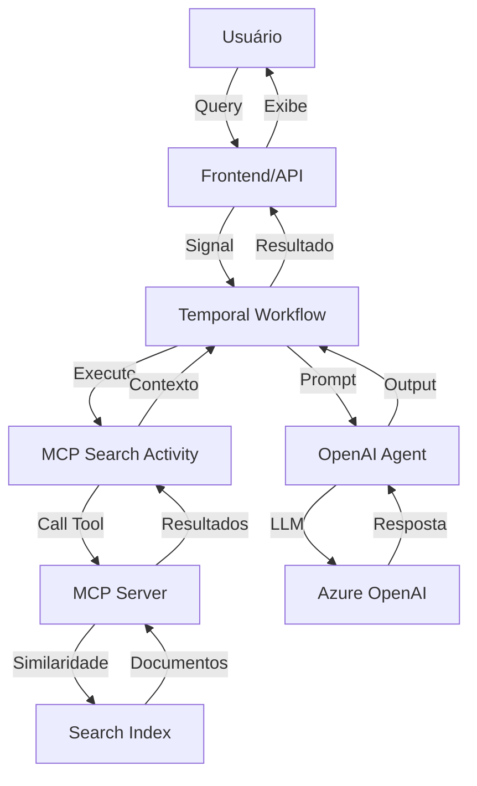

# Arquitetura do Projeto

## Visão Geral

Este projeto implementa um sistema de Question & Answer (Q&A) usando Temporal para orquestração de workflows, Model Context Protocol (MCP) para busca semântica, e Azure OpenAI para geração de respostas.

## Componentes Principais

### 1. Temporal Workflows (`workflows/`)

**Arquivo**: `workflow.py`

- **QnAWorkflow**: Workflow principal que gerencia o ciclo de vida de uma sessão de Q&A
- Recebe perguntas via signals
- Mantém histórico de conversação
- Coordena execução de activities

**Fluxo**:
```
Usuário → Signal(new_task) → Workflow → Activity(MCP Search) → Agent → Resposta
```

### 2. Temporal Activities (`activities/`)

**Arquivo**: `activities.py`

- **mcp_search_activity**: Activity que conecta ao MCP Server e executa busca semântica
- Retorna documentos relevantes baseados na query

### 3. MCP Server (`mcp_server.py`)

- Expõe ferramentas via Model Context Protocol
- **Tool**: `azure_ai_search` - busca semântica usando embeddings
- Calcula similaridade de cosseno entre query e documentos
- Retorna top-k documentos mais relevantes

### 4. API REST (`api/main.py`)

Endpoints:

- `POST /workflows/start` - Inicia um novo workflow
- `POST /workflows/{id}/prompt` - Envia uma pergunta
- `GET /workflows/{id}/status` - Obtém status atual
- `GET /workflows/{id}/history` - Obtém histórico completo
- `POST /workflows/{id}/end` - Finaliza a sessão

### 5. Frontend (`frontend/app.py`)

- Interface Streamlit para interação com usuários
- Mostra estado em tempo real do workflow
- Exibe histórico de conversação
- Permite enviar perguntas e finalizar sessão

### 6. Worker (`worker.py`)

- Processa workflows e activities
- Conecta ao Temporal Server
- Registra plugins (OpenAI Agents)

### 7. Database (`database/`)

- `index.json`: Documentos originais
- `search_index.json`: Documentos com embeddings pré-calculados
- `utils.py`: Script para gerar embeddings

## Fluxo de Dados



## Tecnologias

### Core
- **Temporal**: Orquestração durável de workflows
- **FastMCP**: Implementação do Model Context Protocol
- **OpenAI Agents SDK**: Framework para agentes com ferramentas
- **Azure OpenAI**: LLM (GPT-4o) e embeddings

### API e Frontend
- **FastAPI**: API REST moderna e assíncrona
- **Streamlit**: Interface web interativa
- **Pydantic**: Validação de dados

### Utilitários
- **NumPy**: Cálculos de similaridade
- **python-dotenv**: Gerenciamento de configuração

## Padrões de Projeto

### 1. Workflow Pattern
- Workflows são determinísticos
- Estados persistidos automaticamente
- Retry automático em falhas

### 2. Activity Pattern
- Activities para operações externas (I/O)
- Timeout configurável
- Retry policy customizável

### 3. Signal Pattern
- Comunicação assíncrona com workflows
- Permite interação durante execução
- Fila de mensagens (deque)

### 4. Query Pattern
- Leitura de estado do workflow sem side effects
- Usado para status e histórico

## Escalabilidade

### Horizontal Scaling
- Multiple workers podem processar tasks
- Load balancing automático via Temporal
- Workflows são stateful e resilientes

### Vertical Scaling
- Ajustar recursos do Temporal Server
- Otimizar embeddings (batch processing)
- Cache de resultados (futuro)

## Segurança

- Credenciais via variáveis de ambiente
- `.env` não commitado no git
- API keys do Azure rotacionáveis
- Temporal Server com autenticação (produção)

## Observabilidade

### Logs
- Temporal UI: visualização de workflows
- Logs estruturados em activities
- Métricas do FastAPI

### Debugging
- Temporal Web UI (http://localhost:8080)
- Replay de workflows para debugging
- Query de estado em tempo real

## Melhorias Futuras

1. **Testes**
   - Unit tests para activities
   - Integration tests para workflows
   - E2E tests para API

2. **Cache**
   - Cache de embeddings
   - Cache de respostas LLM

3. **Monitoring**
   - Prometheus metrics
   - Grafana dashboards
   - Alertas

4. **CI/CD**
   - GitHub Actions
   - Testes automáticos
   - Deploy automático

5. **Autenticação**
   - JWT tokens
   - Role-based access control
   - API rate limiting
